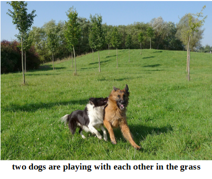

# Image-Captioning
Deep Learning models for image captioning with Python 3 and Keras

# Image captioning using models with object detection or object recognition

This is an implementation adapted from this tutorial: https://machinelearningmastery.com/develop-a-deep-learning-caption-generation-model-in-python/ on Python 3, Keras, and TensorFlow. The models used to extract the features are NASNet or ResNet50, both provided by Keras pre-trained on ImageNet dataset. When fitting the language model (RNN) to generate the captions, you can also pass a file containing the bounding boxes detection (format: x1, y1, x2, y2, class_id, bbox_score). These bounding boxes are passed along with the features extracted using NASNet or ResNet50. 
 


The repository includes:
* Source code of feature extractors (Flickr dataset) using pre-trained models - NASNet and ResNet50.
* Source code to prepare the descriptions (Flickr dataset)
* Training code for the language model according to input features
* Code to evaluate images on Flickr test dataset (with features from object detection, it might need more changes according to your needs)


# Getting Started
* [cnn_feature_extractor](cnn_feature_extractor.py) extracts the features using NASNet or ResNet 50 from Flickr dataset. If you have a model for object detection that saves the results on a file using the format (x1, y1, x2, y2, class_id, bbox_score) for each detection, then it can be used on the next steps as well.
* [preprocess_descriptions](preprocess_descriptions.py) prepares all the descriptions from Flickr dataset to be used on the next steps.
* [rnn_flickr_fit](rnn_flickr_fit.py) will fit the model using the clean descriptions and features (including features from object detection when provided) generated from previous steps. 
* [rnn_flickr_evaluation](rnn_flickr_evaluation.py) evaluates the captions for the whole Flickr test dataset using BLEU metrics. However, it might be necessary some modifications to adjust the code to each need.


## Requirements
Python 3+, TensorFlow, Keras and other common packages listed in `requirements.txt`.


## Installation
1. Install dependencies (Graphviz also has to be installed independently and its bin folder must be included to the PATH environment variable)
   ```bash
   pip install -r requirements.txt
   ```
2. Clone this repository
3. Download the Flickr dataset by fulfilling this form first: https://forms.illinois.edu/sec/1713398


